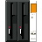
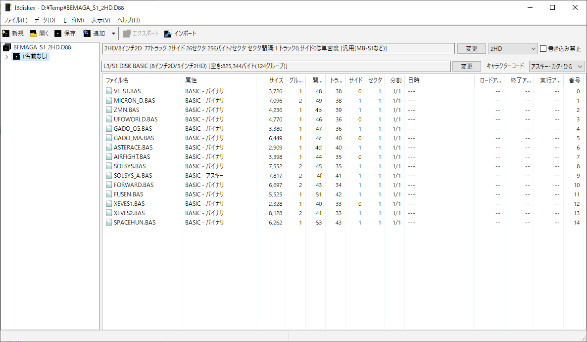

#  L3 Disk Explorer

#### Copyright(C) Sasaji 2015-2024 All Rights Reserved.

------------------------------------------------------------------------------

### L3ディスクエクスプローラは、レトロPC用に作成されたフロッピーディスクイメージ内部のファイルにアクセスするためのアプリケーションです。

### [ダウンロード](https://github.com/bml3mk5/L3DiskEx/releases)

### [ドキュメント](../../tree/master/docs)

対応している DISK BASIC / OS：

日立 LEVEL-3 DISK BASIC / 日立 S1 DISK BASIC /
富士通 F-BASIC /
NEC N88-BASIC / NEC N66-BASIC /
MSX-BASIC / MSX-DOS /
MS-DOS FAT12 (PC-9801/PC-AT) /
シャープ X1/MZ Hu-BASIC / S-OS SWORD /
シャープ MZ S-BASIC系 /
シャープ MZ Floppy DOS /
シャープ X68000 Human68k (FAT12) /
東芝 パソピア T-BASIC /
ソニー SMC-777 Sony Filer /
カシオ FP-1100 C82-BASIC /
FLEX /
OS-9 Level I/II /
CP/M Ver.2.2 /
アップル DOS 3.3 /
アップル ProDOS 8/16 /
コモドール 1541 DOS (Commodore 64) /
コモドール Amiga DOS / AROS /
ソード M68 KDOS (FDOS) /
TF-DOS /
キャリーラボ C-DOS /
キャリーラボ CDOS II /
システムソフト PC-8001用 PC-DOS /
X-DOS /
Frost-DOS /
Magical DOS /
S-DOS / Sn88-DOS /
L-os Angeles /
MDOS

------------------------------------------------------------------------------
### L3 Disk Explorer is an application in order to access to files in a floppy disk image for retro computer and operating system.

### [Downloads](https://github.com/bml3mk5/L3DiskEx/releases)

### [Documents(Japanese)](../../tree/master/docs)

Supported DISK BASIC / OS：

HITACHI LEVEL-3 DISK BASIC / HITACHI S1 DISK BASIC /
FUJITSU F-BASIC /
NEC N88-BASIC / NEC N66-BASIC /
MSX-BASIC / MSX-DOS /
MS-DOS FAT12 (PC-9801/PC-AT) /
SHARP X1/MZ Hu-BASIC / S-OS SWORD /
SHARP MZ S-BASIC /
SHARP MZ Floppy DOS /
SHARP X68000 Human68k (FAT12) /
TOSHIBA PASOPIA T-BASIC /
SONY SMC-777 Sony Filer /
CASIO FP-1100 C82-BASIC /
FLEX /
OS-9 Level I/II /
CP/M Ver.2.2 /
Apple DOS 3.3 /
Apple ProDOS 8/16 /
Commodore 1541 DOS (Commodore 64) /
Commodore Amiga DOS / AROS /
SORD M68 KDOS (FDOS) /
TF-DOS /
Carry Lab. C-DOS /
Carry Lab. CDOS II /
System Soft PC-8001用 PC-DOS /
X-DOS /
Frost-DOS /
Magical DOS /
S-DOS / Sn88-DOS /
L-os Angeles /
MDOS

------------------------------------------------------------------------------

## Disclaimer 免責事項

* This is the free software. I have not abandoned the copyright.
  And each author which created the source code also have the copyright.
* これはフリーソフトです。ただし著作権は放棄していません。
  ソースコードを作成した各々の作者にも著作権があります。
* No warranty: We are not responsible for any damage caused by this software.
* 無保証: このソフトを使用したいかなる損害も一切保証しません。

------------------------------------------------------------------------------

  Sasaji (sasaji@s-sasaji.ddo.jp)

  http://s-sasaji.ddo.jp/bml3mk5/

  (X(Twitter): https://twitter.com/bml3mk5)

------------------------------------------------------------------------------
